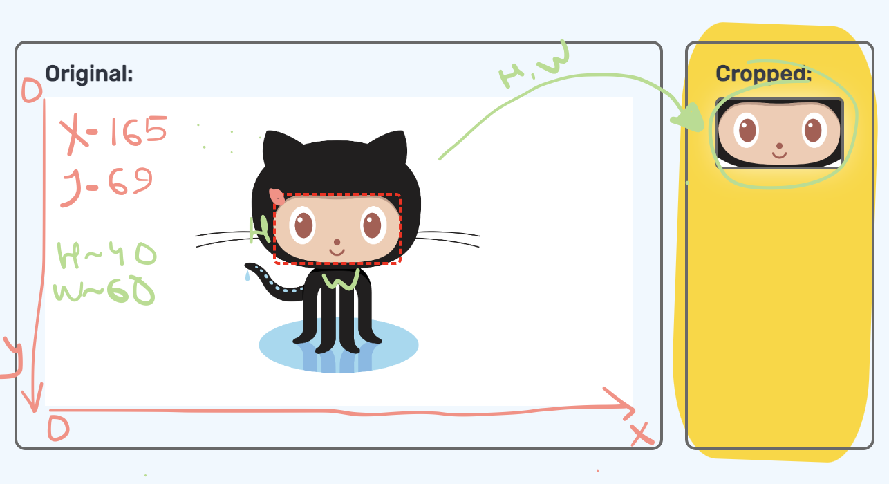

# `use-cropped-area`

[![NPM version][npm-image]][npm-url]
[![npm-typescript]][npm-typescript-url]
[![Test][github-test]][github-test-url]
[![Build][github-build]][github-build-url]
[![License][github-license]][github-license-url]

use-cropped-area is a `react` hook for creating canvas image from the cropped area of image.



[**Live Creativity Demo**](https://typeof-null.github.io/use-cropped-area/)


## Installation

```bash
npm install use-cropped-area --save-dev
```

or

```bash
yarn add -D use-cropped-area
```


## Usage

```js
import React, { useRef, useMemo, useState } from 'react'
import useCroppedArea, { Area, AreaKey } from 'use-cropped-area'
import { INITIAL_AREA, CANVAS_STYLES } from './constants'

function Example() {
    const [area, setArea] = useState<Area>(INITIAL_AREA)
    const image = useRef<HTMLImageElement | null>(null)
    const canvasRef = useCroppedArea({ area, image: image.current })
    
    const handleChangeArea = (key: AreaKey, value: number) => 
        setArea((prev) => ({ ...prev, [key]: value }))

    const {width, height} = area
    const canvasStyle = useMemo(() => ({
        ...CANVAS_STYLES,
        width,
        height,
    }), [width, height])
    return (
       <Content> 
           <Side>
                <ImageWithCrop
                    ref={image}
                    area={area}
                    src='/path_to_image'
                    onChange={handleChangeArea}
                />
           </Side>
           <Side>
                <canvas ref={canvasRef} style={canvasStyle} />
           </Side>   
       </Content>    
    )
}
```

## Api
<div id="api" />

| Property |              Description               |                                Type |          | Default Prop |
|---------:|:--------------------------------------:|------------------------------------:|:--------:|:------------:|
|    area* |         Cropped area of image          |             Area / null / undefined | required |              |
|   image* |    Image is used for cropping area     | HTMLImageElement / null / undefined | required |              |
|  drawing | Control of drawing the canvas element  |                             boolean | optional |     true     |


## License

[MIT](LICENSE)

[npm-url]: https://www.npmjs.com/package/use-cropped-area
[npm-image]: https://img.shields.io/npm/v/use-cropped-area
[github-license]: https://img.shields.io/github/license/typeof-null/use-cropped-area
[github-license-url]: https://github.com/typeof-null/use-cropped-area/blob/master/LICENSE
[npm-typescript]: https://img.shields.io/npm/types/use-cropped-area
[npm-typescript-url]: https://www.typescriptlang.org/
[github-build]: https://github.com/typeof-null/use-cropped-area/actions/workflows/publish.yml/badge.svg
[github-build-url]: https://github.com/typeof-null/use-cropped-area/actions/workflows/publish.yml
